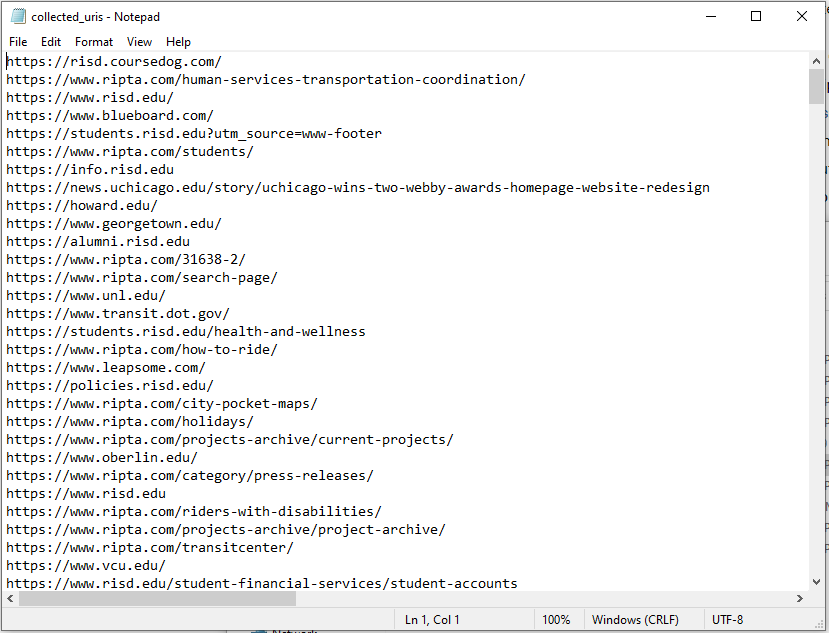
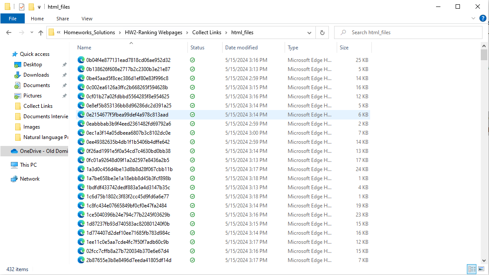
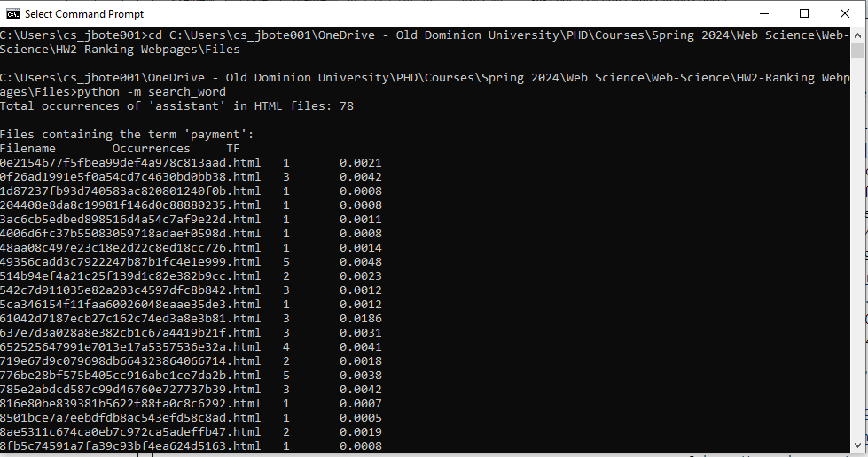

# Ranking Webpages

This assignment involves the collection, processing, and analysis of web page data to understand and rank web pages based on the frequency and importance of specific terms. The tasks are executed using Python scripts and focus on practical applications of web scraping, data processing, and the calculation of TF-IDF (Term Frequency-Inverse Document Frequency) for ranking purposes.

## Q1. Data Collection

In this section, several Python scripts are employed to gather and process web page data. These scripts were executed through the Command Prompt in Windows 11.

*Link Collection:*
A Python script ('collect-webpages_HW2') is used to collect URIs of web pages. This script uses the requests module and BeautifulSoup library to fetch links starting from an initial URL provided as an argument. The URIs are stored in a text file. This step was completed in the first assignment.

*Download HTML Content:*
The 'Download_html' script downloads the HTML content of the collected URIs. Using the requests module, this script performs HTTP requests and saves the HTML content into individual files, named by hashing the URIs. Execution involves providing the text file with links, and the HTML files are saved in a 'html_files' folder. Additionally, a mapping file was created to link URIs with their respective HTML document names. The image below shows a screenshot of a portion of the downloaded content.

*Removing Standard HTML Text:*
To process the HTML content and remove boilerplate text, another script using the boilerpy3 library was employed. This script processes the HTML files in the 'html_files' folder to try to remove boilerplate text. However, the output resulted in 0B size files, indicating that the HTML files do not contained boilerplate text.

*Word Occurrence Counting:*
Another script was developed to search HTML files containing a specific word. The script counts the occurrences of the word 'assistant' in the documents. The script outputs the document names along with the count of the word's occurrences. This script also calculate the TF metric for the query word across the documents. It was executed from the command line with the search word and the folder containing the HTML files as inputs. 

*Q1-1: How many of your 500 URIs produced useful text?  If that number was less than 500, did that surprise you?* 

Out of the 500 URIs collected, 393 produced useful text. This result was expected to me because not all web pages provide substantial textual content. Many pages might primarily serve as navigation interfaces, contain multimedia without much text, or include large amounts of boilerplate HTML code (such as headers, footers, and advertisements) which do not contribute to the main content.

## Q2. Rank with TF-IDF

Using the word 'assistant' for the query, it was found that 39 documents contained the term. with 84 total occurrences of the word into those documents. Out of these, 10 documents from different domains were selected for TF-IDF calculation.

To calculate TF:

$$ TF = \frac{\text{Occurrences in doc}}{\text{Words in doc}} $$

To calculate IDF: 

$$ \log_2\left(\frac{\text{Total docs in corpus}}{\text{Docs with term}}\right) $$

To calculate TF- IDF:

$$ \text{TF-IDF} = \text{TF} \times \text{IDF} $$

I used 4 Billion as the total size of the corpus

|File	|Occurrences| TF | IDF  | TF-IDF |URI
|------:|---:|---:|-----:|-----:|---
|1. 0e2154677f5fbea99def4a978c813aad.html| 1 |  0.0021 | 26.12 | 0.0548 |https://careercenter.risd.edu/
|2. 0f26ad1991e5f0a54cd7c4630bd0bb38.html| 3 |  0.0042 | 26.12 | 0.1097 |https://www.odu.edu/about/orgchart
|3. 4006d6fc37b55083059718adaef0598d.html| 1 |  0.0008 | 26.12 | 0.0208 |https://www.princeton.edu/
|4. 542c7d911035e82a203c4597dfc8b842.html| 3 |  0.0012 | 26.12 | 0.0313 |https://ischool.sjsu.edu/istudent-blog
|5. 5ca346154f11faa60026048eaae35de3.html| 1 |  0.0012 | 26.12 | 0.0313 |https://www.stanford.edu/
|6. 637e7d3a028a8e382cb1c67a4419b21f.html| 3 |  0.0031 | 26.12 | 0.0809 |https://www.snappy.com/
|7. 7e03dd2cce56eee58303626629173d65.html| 2 |  0.0019 | 26.12 | 0.0496 |https://biodevices.scitevents.org/ProgramCommittee.aspx#program_chair
|8. 865da2cb420e7065862a2e7d228dace1.html| 1 |  0.0001 | 26.12 | 0.0026 |https://www.slideshare.net/SampathJayarathna/multimodal-sensing-with-neuroinformation-retrieval
|9. b28630ab99697c97c9847092109b1e9e.html| 1 |  0.0014 | 26.12 | 0.0365 |https://www.ripta.com/ceo-board-of-directors/
|10. b3fabcb9b8132e7f2a9c86a2a6466214.html| 1 |  0.0010 | 26.12 | 0.0261 |https://support.google.com/youtube/answer/174084

10 Hits for the term "Assistant", ranked by TF-IDF.
2. https://www.odu.edu/about/orgchart
6. https://www.snappy.com/
1. https://careercenter.risd.edu/
7. https://biodevices.scitevents.org/ProgramCommittee.aspx#program_chair
9. https://www.ripta.com/ceo-board-of-directors/
4. https://ischool.sjsu.edu/istudent-blog
5. https://www.stanford.edu/
10. https://support.google.com/youtube/answer/174084
3. https://www.princeton.edu/
8. https://www.slideshare.net/SampathJayarathna/multimodal-sensing-with-neuroinformation-retrieval

## Q3. Rank with PageRank

In this Step the 10 URIs from Q2 were ranked by their pagerank. For this process the free PR estimator https://dnschecker.org/pagerank.php was used.

the values were normalized between 0 and 1  using: 

$$ X_{\text{norm}} = \frac{X - \text{Min}}{\text{Max} - \text{Min}} $$

Table 2.  10 hits for the term "shadow", ranked by PageRank of domain.
|PageRank|  PageRank Normalized  |URI
|-----:|-------:|---
|10  |	  1       |https://support.google.com/youtube/answer/174084
|8   |    0.71    |https://www.slideshare.net/SampathJayarathna/multimodal-sensing-with-neuroinformation-retrieval
|7   |    0.57    |https://www.princeton.edu/
|7   |    0.57    |https://www.stanford.edu/
|6   |    0.43    |https://www.odu.edu/about/orgchart
|5   |    0.29    |https://www.snappy.com/
|5   |    0.29    |https://www.ripta.com/ceo-board-of-directors/
|5   |    0.29    |https://ischool.sjsu.edu/istudent-blog
|3   |     0      |https://careercenter.risd.edu/
|3   |     0      |https://biodevices.scitevents.org/ProgramCommittee.aspx#program_chair

*Q3-1: Briefly compare and contrast the rankings produced in Q2 and Q3.*
In Q2, the 10 URIs were ranked based on their TF-IDF scores for the term "Assistant", while in Q3, the same URIs were ranked based on their PageRank values of the domains. It is observed that the ranking is different using in Q2 and in Q3. this is because TF-IDF, used in Q2, measures the relevance of a term within a specific document only considering a corpus of documents while page rank can take into consideration other things that make the domain relevant within a search engine.
