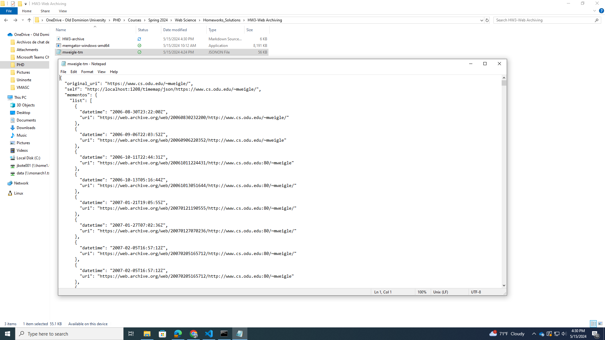

# Homework 3 - Web Archiving, part 1 

The purpose of this assignment is to introduce the concept of web archiving and mementos by obtaining TimeMaps through the installation and use of Memgator.

## Downloading Memgator

To start, I tested the installation of Memgator in my computer using the specific command showed below.

**Test out my installation of memgator**
./memgator-darwin-amd64 -a https://raw.githubusercontent.com/odu-cs432-websci/public/main/archives.json -F 2 -f JSON https://www.cs.odu.edu/~mweigle/ > mweigle-tm.jsonon

The result showed a timemap for the website of Dr. Weigle.

**What do the -F 2 and -f JSON options do?**
According to the documentation provided by the creators of Memgator in their Github F an f have the following funtionalities:

-**F 2:** Sets the failure tolerance limit for each archive. This determines how many failures are acceptable before stopping the process. In this case two.

-**f JSON:** This option specifies the output format of the aggregated TimeMap. By setting -f JSON, we instruct Memgator to output the TimeMap in JSON format.

## Q1. Get TimeMaps for Each URI.

In this part of the process, I obtained the [TimeMaps](http://www.mementoweb.org/guide/quick-intro/) for each of the unique URIs I collected in HW1 using the [MemGator Memento Aggregator](https://github.com/oduwsdl/MemGator). For this task I made a [python script](https://github.com/jgbotello/Web-Science/blob/main/HW3-Web%20Archiving/get%20Timemaps/get_timemaps.py) that was then executed from the command line. 

The process included generating the TimeMaps in JSON format for each URI and saving them, making sure to include a 15-second break between each request to avoid connection errors or crashes from the web archives. During the process, I encountered some URI-Rs that had no mementos, which was expected. For very large TimeMaps, I opted to compress the files individually using [gzip](https://github.com/jgbotello/Web-Science/blob/main/HW3-Web%20Archiving/get%20Timemaps/compress.py) in python to better manage storage space and facilitate further analysis. Finally, I uploaded all the generated TimeMaps to a [repository on GitHub](https://github.com/jgbotello/Web-Science/tree/main/HW3-Web%20Archiving/get%20Timemaps/timemaps), organizing them in a separate folder from the report for use in future tasks.

### Q2. Analyze Mementos Per URI-R.

I used the TimeMaps saved in Q1 to analyze the archival quality of the URIs collected in HW1. By examining the TimeMaps, I was able to determine how well each URI was archived over time. The table below displays the number of URI-Rs (original resource URIs) and the corresponding number of mementos (archived versions) they have. To do this, I created a Python script that decompresses the compressed JSON files, counts the number of mementos for each URI-R, and finds the URI-R with the highest number of mementos. In addition, the script generates a table with the distribution of mementos and provides the name of the file containing the URI-R with the most mementos. Notese que 70 de las URI-R no contenian informacion de Mementos. 

| Mementos Range    | URI-Rs |
|-------------------|--------|
| 0                 | 70     |
| 1-5               | 44     |
| 6-10              | 13     |
| 11-20             | 28     |
| 21-30             | 39     |
| 31-50             | 56     |
| 51-100            | 37     |
| 101-200           | 39     |
| 201-500           | 42     |
| 501-1000          | 8      |
| 1001-5000         | 14     |
| 5001-10000        | 9      |
| 10001+            | 17     |

*Q: What URI-Rs had the most mementos?  Did that surprise you?*
The URI-R with the most mementos was https://www.youtube.com/kids/. This finding did not come as a surprise. YouTube is a highly popular platform, and its various subdomains, including YouTube Kids, are frequently updated and accessed by millions of users worldwide. The high frequency of updates and the site's significant traffic likely contribute to the large number of mementos.

