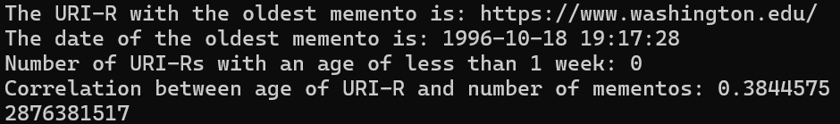
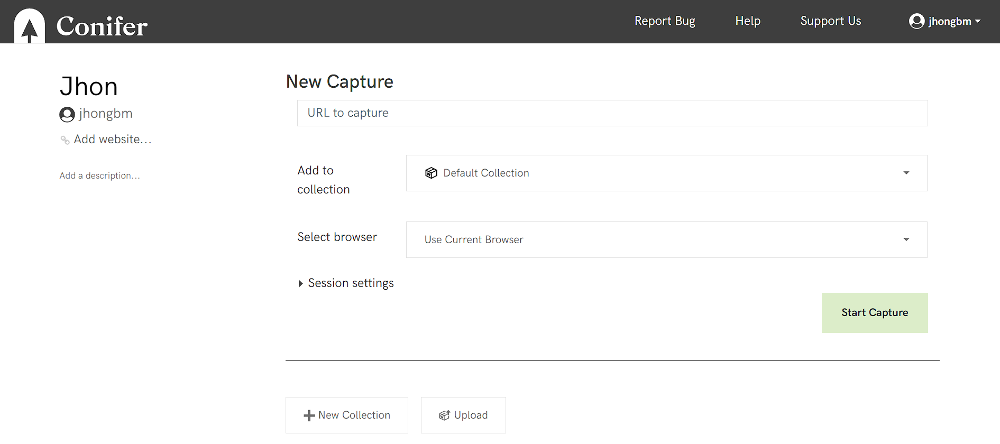
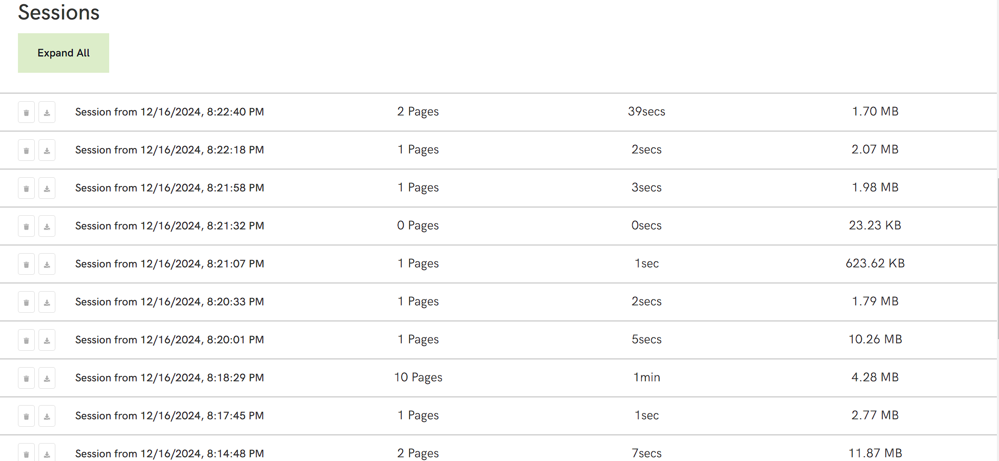
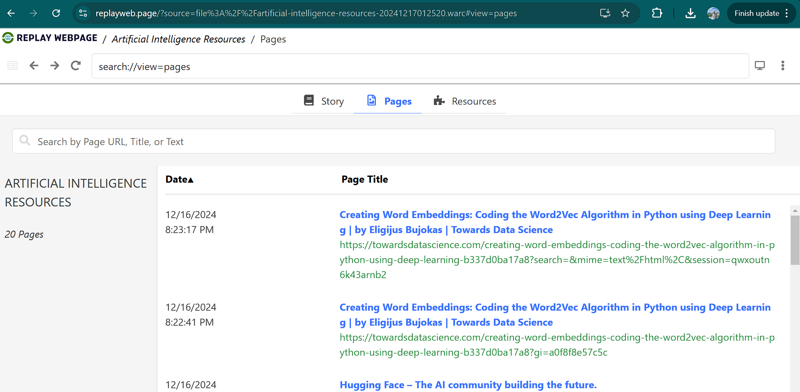
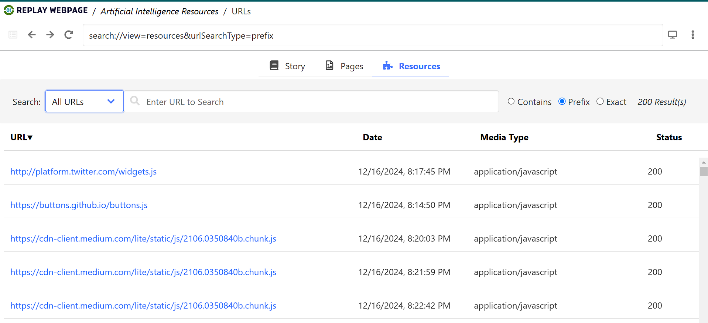
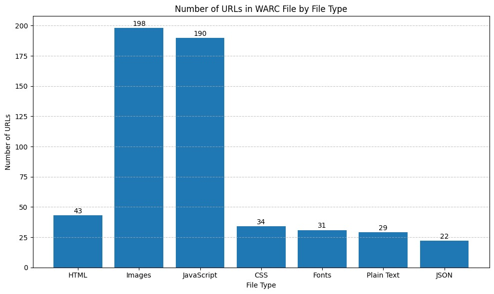

# Homework 4 - Web Archiving, part 2

## Assignment

### Q1. Analyze Datetimes of Mementos.

In this question, my objetive was to determine how well each URI was archived over time by examining the number and age of its mementos. To achieve this, I created a Python script that processes compressed JSON files containing the TimeMaps. These files were saved as part of [Homework 3 (Web Archiving Part 1)](https://github.com/jgbotello/Web-Science/tree/main/HW3-Web%20Archiving/get%20Timemaps/timemaps).

The script decompresses each .json.gz file and extracts the datetime of the earliest memento for each URI-R. Using the date when the TimeMaps were collected as a reference point, I calculate the age in days between the collection date and the earliest memento datetime. The script also counts the total number of mementos for each URI-R.

With this data, I generate a scatterplot using Matplotlib and Pandas. The x-axis represents the age of each URI-R in days, and the y-axis shows the number of mementos. This visualization allows me to observe patterns in the archival frequency of different URIs.

the output of the scrips shows the scatter plot,correlation, the URI-R and date of the oldest memento, and the number of URI-Rs with an age of less than 1 week. The image below shows the output.

**Q1.1: What can you say about the relationship between the age of a URI-R and the number of its mementos?**

The correlation between the age of URI-Rs (in days) and the number of mementos is 0.384. This suggests a positive but moderate correlation. Older URI-Rs tend to have more mementos, but the relationship is not very strong. my consideration is that while age contributes to the number of mementos, other factors (like importance, popularity, or frequency of updates) may also influence how often a URI-R is archived.

**Q: What URI-R had the oldest memento? Did that surprise you?**

The URI-R with the oldest memento is [https://www.washington.edu/](https://www.washington.edu/). The date of the memento is October 18, 1996. 
Does it surprise me? Yes, it is somewhat surprising because 1996 represents an early period in web history when web archiving efforts were just starting (e.g., the Internet Archive was founded in 1996). The fact that a memento from 1996 exists indicates that this URI-R might be a historically significant website. It makes sense because it is the University of washington wich was stablished in 1861.

**Q: How many URI-Rs had an age of < 1 week, meaning that their first memento was captured the same week you collected the data**      

The number of URI-Rs with an age of less than 1 week is 0. None of the analyzed URI-Rs had their first memento captured in the same week as the data collection. It was expected to me because most websites are not new, and web crawlers from the Internet Archive have been continuously working for a long time.

### Q2. Explore Conifer and ReplayWeb.Page

**Create an account at [Conifer](https://conifer.rhizome.org) and create a collection.  Archive at least 10 webpages related to a common topic that you find interesting. Make the collection public and include the link to your collection in your report.**

The images below illustrate the my account and my collection. To access my Conifer collection clic on the following link: [https://conifer.rhizome.org/jhongbm/artificial-intelligence-resources/management](https://conifer.rhizome.org/jhongbm/artificial-intelligence-resources/management).

*Q: Why did you choose this particular topic?*

I chose Artificial Intelligence as my topic because it aligns with my research focus. The archived links include source materials, tools, and resources related to AI and its complementary areas.

*Q: Did you have any issues in archiving the webpages?*

the only challenge I had was that While archiving the webpages, some websites contained dynamic content, which caused them to take longer to load or not display correctly during recording.

*Q: Do the archived webpages look like the original webpages?*

For most webpages, the archived versions look like the originals. However, one of the URI-Rs did not display correctly. It showed special characters, likely due to issues with its dynamic content or encoding format.

**After creating your collection at Conifer, download the collection as a WARC file (see [Exporting or Downloading Content](https://guide.conifer.rhizome.org/docs/manage-sessions/exporting-warc/)).**

The WARC file is available by clicking [here]([XXXXXXXXXXXXXX](https://github.com/jgbotello/Web-Science/blob/main/HW4-Web%20Archiving%20part%202/Conifer/artificial-intelligence-resources-20241217012520.warc))

Then load this WARC file into [ReplayWeb.page](https://replayweb.page), a tool from the Webrecorder Project (folks who developed Conifer).  From <https://webrecorder.net/tools>: 

<blockquote>ReplayWeb.page provides a web archive replay system as a single web site (which also works offline), allowing users to view web archives from anywhere, including local computer or even Google Drive. See the <a href="https://replayweb.page/docs">User guide</a> for more info.</blockquote> 

Once the WARC file has loaded, click on the "Pages" tab.  Take a screenshot that includes the list of pages and the browser address bar (showing `replayweb.page/?source=file%3A%2F%2F`..., which indicates that the WARC file is being loaded from your local computer).

Then click on the "URLs" tab and choose "All URLs" from the dropdown menu.  

**Q: How many URLs were archived in the WARC file?  How does this compare to the number of Pages?**

A total of 547 URLs were archived. This number is significantly higher than the 10 pages. The discrepancy in this case arises because webpages often include many additional resources, such as images, JavaScript files, CSS, fonts. Each resorce is a URL that contributes to the total count.

**Create a bar chart showing the number of URLs in the WARC file for each of the file types in the dropdown menu.**

**Q: Which file type had the most URLs?  Were you surprised by this?**

The file type with the most URLs was Images, with a total of 198 URLs. This result is not entirely surprising because webpages typically include numerous images, such as banners, icons, logos, and other graphics, so it contributes to the total count.
