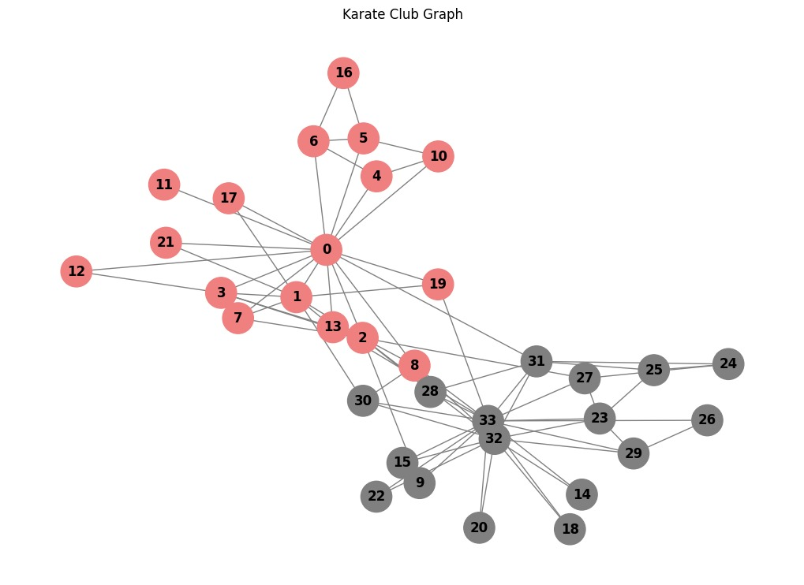

# Homework 5 - Graph Partitioning

## Assignment 

This assignment will have you investigate the split of the Karate Club (Zachary, 1977), described starting on [slide 92 in the Social Networks lecture slides](https://docs.google.com/presentation/d/1G9bY32EslxRdIq7znDZoGJd3-_Ock1FeJcqN3QgQuy4/edit#slide=id.g7e0acafd7b_0_0).  You must use a Python or JavaScript library (as discussed in the [Graph Vis slides](https://docs.google.com/presentation/d/1M_c2CKSnVS9fe-1vAfV4sac6KoZ36KdknFiYBL575uw/edit?usp=sharing)) to generate the graphs required in this assignment.
 

### Q1. Color nodes based on final split

**Draw the original Karate club graph (before the split) and color the nodes according to the factions they belong to (John A or Mr. Hi).  This should look similar to the graph on slide 92 - all edges should be present, just indicate the nodes in the eventual split by color.**

To visualize the split in the Karate Club graph, I used Zachary's Karate Club dataset from the NetworkX library. This graph represents the relationships (friendships) between members of a karate club that split into two factions after a conflict. Mr. Hi's faction and John A's faction are shown in grey and light coral, respectively.

*Q: How many nodes eventually go with John and how many with Mr. Hi?*
Number of nodes in Mr. Hi: 17
Number of nodes in John A: 17

### Q2. Use the Girvan-Newman algorithm to illustrate the split

**We know the "real" result of the Karate Club split, which you've colored in Q1. Your task is to use the Girvan-Newman algorithm to show that this result of the split could have been predicted by the weighted graph of social interactions.  How well does the mathematical model represent reality?  Generously document your answer with all supporting equations, code, graphs, arguments, etc.**

**Keeping the node colors the same as they were in Q1, run multiple iterations of the Girvan-Newman graph partioning algorithm (see [Social Networks, slides 90-99](https://docs.google.com/presentation/d/1G9bY32EslxRdIq7znDZoGJd3-_Ock1FeJcqN3QgQuy4/edit#slide=id.p98)) on the Karate Club graph until the graph splits into two connected components. Include an image of the graph *after each iteration in your report.** 

**Note that you will have to implement the Girvan-Newman algorithm rather than relying on a built-in function, because a built-in function will automatically run the whole algorithm and you will not be able to view the intermediate graphs.  Make sure that you explain in your report what the Girvan-Newman algorithm is doing.**

In this task, I implemented the Girvan-Newman algorithm to predict the split in Zachary's Karate Club graph. 

As explained in the videos and showed in the slides, the Girvan-Newman algorithm is a graph partitioning method by progressively removing edges with the highest betweenness. Slide 90 shows the following steps:

1. Calculate betweenness of all edges

2. Remove the edge(s) with highest betweenness

3. Repeat steps 1 and 2 until graph is partitioned into as many regions as desired

Edges with high betweenness often act as "bridges" between clusters. 

I implemented the algorithm by creating a funtion in python to make the process easier. In each iteration I visualize the edges that were removed. The [code](https://github.com/jgbotello/Web-Science/blob/main/HW5-Graph%20Partitioning/code/Code.ipynb) follows these key steps:

1. Load the Karate Club graph using NetworkX.

2. Compute the edge betweenness at each iteration.

3. Identify and remove edges with the highest betweenness.

4. Visualize the graph after each iteration using Matplotlib.

5. Stop the process when the graph splits into two connected components.

*Q: How many iterations did it take to split the graph?*  

### Q3. Compare the actual split to the mathematical split

Compare the connected components of the Girvan-Newman split graph (Q2) with the connected components of the actual split Karate club graph (Q1). 

*Q: Did all of the same colored nodes end up in the same group?  If not, what is different?*

### Useful Resources

* Wayne Zachary, ["An Information Flow Model for Conflict and Fission in Small Groups"](http://aris.ss.uci.edu/~lin/76.pdf), 1977 - original paper 
* [Zachary's Karate Club](https://en.wikipedia.org/wiki/Zachary's_karate_club) (Wikipedia)
* Data 
   * matrix format: [UCINET IV Version 1.0 DATASETS](http://vlado.fmf.uni-lj.si/pub/networks/data/Ucinet/UciData.htm#zachary)
   * GML file: [Gephi Datasets](https://github.com/gephi/gephi/wiki/Datasets)
   * [karate_club_graph()](https://networkx.org/documentation/stable/auto_examples/graph/plot_karate_club.html) in [NetworkX](https://networkx.org/documentation/stable/index.html)
* Example code
  * [CS 432/532 Google Colab notebook](https://github.com/odu-cs432-websci/public/blob/main/432_NetworkX_example.ipynb)
  * [CommunityGirvanNewman](https://snap.stanford.edu/snappy/doc/reference/CommunityGirvanNewman.html) in [Snap.py](https://snap.stanford.edu/snappy/doc/tutorial/index-tut.html) 
  * [community_edge_betweenness()](https://igraph.org/python/doc/api/igraph.Graph.html#community_edge_betweenness) in [igraph-python](https://igraph.org/python/) 
  * [edge_betweenness_centrality()](https://networkx.org/documentation/stable/reference/algorithms/generated/networkx.algorithms.centrality.edge_betweenness_centrality.html#networkx.algorithms.centrality.edge_betweenness_centrality) in [NetworkX](https://networkx.org/)
  * [number_connected_components()](https://networkx.org/documentation/stable/reference/algorithms/generated/networkx.algorithms.components.number_connected_components.html#networkx.algorithms.components.number_connected_components) in [NetworkX](https://networkx.org/)
  * ["What are the differences between community detection algorithms in igraph?"](http://stackoverflow.com/questions/9471906/what-are-the-differences-between-community-detection-algorithms-in-igraph/9478989#9478989), StackOverflow question/answer
  * ["Are there implementations of algorithms for community detection in graphs? "](http://stackoverflow.com/questions/5822265/are-there-implementations-of-algorithms-for-community-detection-in-graphs), StackOverflow question/answer

## Extra Credit

### Q4. *(1 point)*
We know the group split in two different groups.  Suppose the disagreements in the group were more nuanced.  What would the clubs look like if they split into 3, 4, and 5 groups?  A single node can be considered as a "group".

### Q5. *(various)*
Use D3.js's force-directed graph layout to draw the Karate Club Graph before the split. Color the nodes according to the factions they belong to (John A or Mr. Hi). After a button is clicked, split the graph based on the original graph split. Include a link to the HTML/JavaScript files (or Observable notebook) in your report and all necessary screenshots.
* If you load a new file containing the split upon button press, this EC is worth 2 points.
* If you modify the nodes and edges using D3 (without loading a new file), this EC is worth 4 points.
* If you use D3 transitions to move the nodes and edges to their new locations, this EC is worth 6 points.
