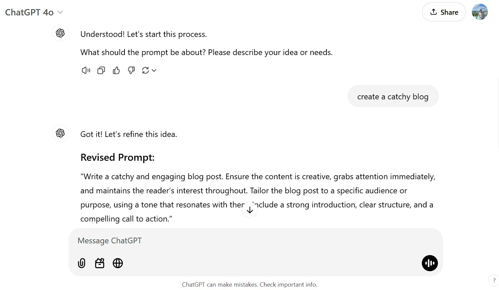

# Homework 8 - Exploring LLMs 

## Assignment

This assignment will have you explore different ways of using LLMs, such as ChatGPT.   

### Q1. Word Vectors

In the LLM lecture, we saw examples from the WebVectors website at <http://vectors.nlpl.eu/explore/embeddings/en/> ([read more about the project](http://vectors.nlpl.eu/explore/embeddings/en/about/)). In this question, you'll explore some of the tasks that the website enables. Use the "English Wikipedia" model, and use the [Random Noun Generator](https://randomwordgenerator.com/noun.php) to generate words.  Include screenshots in your report to document your work.

1. Use <http://vectors.nlpl.eu/explore/embeddings/en/misc/> to calculate semantic similarity between pairs of words.  Generate two random words and calculate their similarity.  Then change one of the two words so that you get a higher similarity value.

2. Use <http://vectors.nlpl.eu/explore/embeddings/en/similar/> to find words semantically closest to the query word. Generate a random word and find its 10 nearest semantic associates.  Click on the top rated semantic associate. Was the original word the top related word for it?  (For instance, if you started with "girlfriend" and found that "boyfriend" was the top associate, is "girlfriend" the top associate for "boyfriend"?)

I began my exploration with the word "desk," which led me to its top 10 semantic associates. The top result was "drawer." When I clicked on "drawer," I found that its top semantic associate was "cupboard." We can see here that the path did not circle back to "desk." This demonstrates that semantic relationships can branch out and shows new connections rather than being strictly reciprocal. This is important because it shows how word embeddings capture nuanced relationships between words, and when generating an answer, we will not necessarily get the same top-associated word.

3. Use <http://vectors.nlpl.eu/explore/embeddings/en/similar/> to get the visualizations for a word in the chosen model.  Generate a random word (different than the previous one), find its 10 nearest semantic associates, and click on the generated link ("Semantic associates for [LINKED WORD]") to see the visualization.  Include a screenshot of the force-directed diagram that is generated.

### Q2. ChatGPT Prompts

**Find 5 interesting ChatGPT prompts and demonstrate their use. Document where you found out about the prompt.**

**Prompt 1:**

*Source:* [https://github.com/f/awesome-chatgpt-prompts?tab=readme-ov-file](https://github.com/f/awesome-chatgpt-prompts?tab=readme-ov-file)

*Prompt:* "I want you to act as an English translator, spelling corrector and improver. I will speak to you in any language and you will detect the language, translate it and answer in the corrected and improved version of my text, in English. I want you to replace my simplified A0-level words and sentences with more beautiful and elegant, upper level English words and sentences. Keep the meaning same, but make them more literary. I want you to only reply the correction, the improvements and nothing else, do not write explanations. My first sentence is "istanbulu cok seviyom burada olmak cok guzel"

*Answer from ChatGPT:*

**Prompt 2:**

*Source:* [https://github.com/f/awesome-chatgpt-prompts?tab=readme-ov-file](https://github.com/f/awesome-chatgpt-prompts?tab=readme-ov-file)

*Prompt:* I want you to act as an interviewer. I will be the candidate and you will ask me the interview questions for the position position. I want you to only reply as the interviewer. Do not write all the conservation at once. I want you to only do the interview with me. Ask me the questions and wait for my answers. Do not write explanations. Ask me the questions one by one like an interviewer does and wait for my answers. My first sentence is "Hi"

*Answer from ChatGPT:*

**Prompt 3:**

*Source:* [Reddit](https://www.reddit.com/r/ChatGPT/comments/13cklzh/what_are_some_of_your_favorite_chatgpt_prompts/?rdt=61786)

*prompt:* I want you to become my Prompt engineer. Your goal is to help me craft the best possible prompt for my needs. 
The prompt will be used by you, ChatGPT. You will follow the following process:
1. Your first response will be to ask me what the prompt should be about. I will provide my answer, but we will 
need to improve it through continual iterations by going through the next steps.
2. Based on my input, you will generate 2 sections, a) Revised prompt (provide your rewritten prompt, it should 
be clear, concise, and easily understood by you), b) Questions (ask any relevant questions pertaining to what 
additional information is needed from me to improve the prompt).
3. We will continue this iterative process with me providing additional information to you and you updating 
the prompt in the Revised prompt section until I say we are done.

*Answer from ChatGPT:*

**Prompt 4:**

*Source:* [Linkein](https://www.linkedin.com/pulse/5-pro-chatgpt-prompts-writing-blog-posts-anupam-chatterjee-lcirc/)

*Prompt:* Please write a blog post about [insert the topic] and use facts and data throughout the article while citing your sources as well as write the introduction in a storytelling format.

*Answer from ChatGPT:*

**Prompt 5:**

*Source:* [https://github.com/f/awesome-chatgpt-prompts?tab=readme-ov-file](https://github.com/f/awesome-chatgpt-prompts?tab=readme-ov-file)

*Prompt:* I want you to act as a motivational coach. I will provide you with some information about someone's goals and challenges, and it will be your job to come up with strategies that can help this person achieve their goals. This could involve providing positive affirmations, giving helpful advice or suggesting activities they can do to reach their end goal. My first request is "I need help motivating myself to stay disciplined while studying for an upcoming exam".

*Answer from ChatGPT:*

### Q3. Explain Topic Using ChatGPT

**Ask ChatGPT to explain a concept from this course that you’ve found confusing. Did the explanation help? Try continuing the conversation and asking further questions or to have it explained in a different way.**

This exercise helped me improve the way I draft prompts in a practical and hands-on manner. It taught me about structure and how the model's response changes when a question is asked through a well-planned prompt. The difference in the model's response when asked to explain a topic in a different way is interesting, as it can understand the context and adapt its explanation accordingly. It would be great to explore how kindergarten teachers are using these tools.

### Q4. Explore Academic References with ChatGPT

**Pick 3 members of the ODU faculty and ask ChatGPT to describe their research and provide 2 of their best known papers. Do the papers exist? Describe how you checked.** 

ChatGPT provided an accurate description of the research areas for Dr. Michele Weigle and Dr. Jose Padilla. However, while it identified two research papers and included links to them, these were not their most well-known papers. A check on Google Scholar revealed that they were not the ones with the highest number of citations. Overall, I consider ChatGPT to be a great tool for getting an overview of any topic, but it should not be used as the main source of information.

