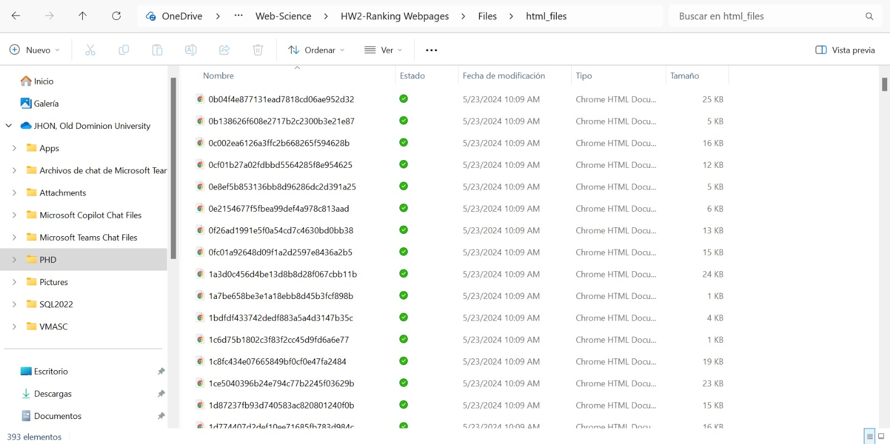
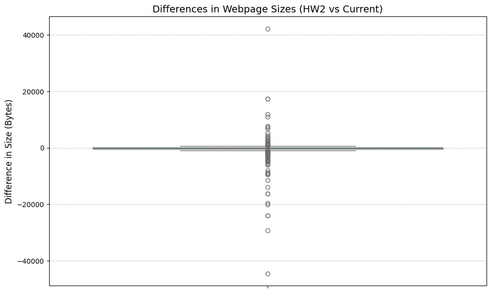
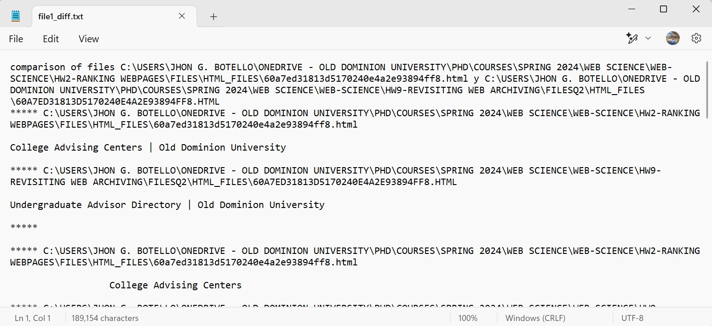
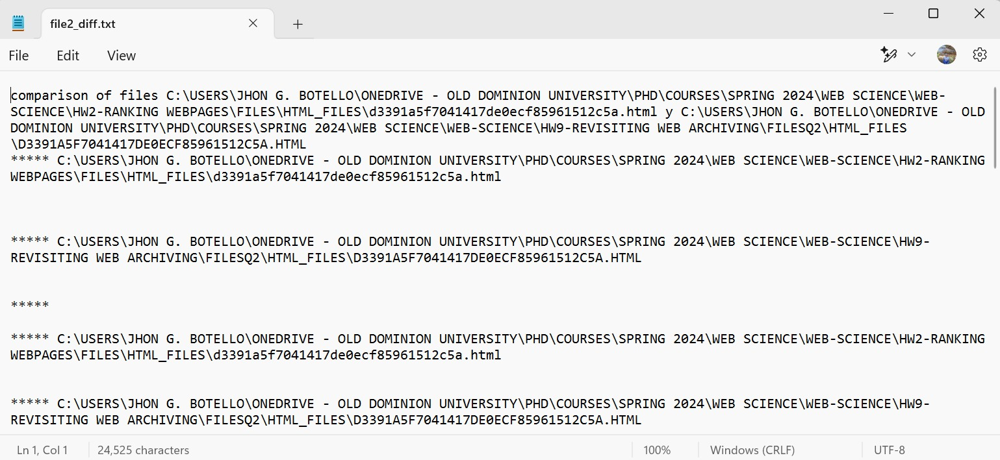
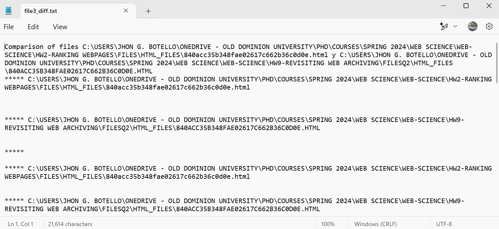

# Homework 9 - Revisiting Web Archiving, Part 3 

## Assignment
 
### Q1. Get TimeMaps for Each URI (again)

**Re-download the 500 TimeMaps from Q1 in [HW3](HW3-archive.md).  About 2 months have passed since you first collected these TimeMaps, so it's likely that things have changed (pages could have been archived more since then, or the state of the web archives could have changed).**

**We want to see how the size of the 500 TimeMaps have changed.  To do this, you will calculate the difference between the number of mementos (URI-Ms) in each TimeMap for the HW3 ones and the new ones. Calculate the difference such that:**

* if a TimeMap has "shrunk" (has fewer mementos now than it did in HW3), it will have a negative value
* if it has stayed the same, it will have a "0" value
* if it has grown (has more mementos now than it did in HW3), the value will be positive. 

To address this question, I reused the code developed for HW3, adapting it to analyze the differences in the number of mementos extracted. For each URL, I retrieved the number of mementos recorded when the timemap was downloaded five months ago and compared it with the current number of mementos. To ensure accuracy, I saved the results in an Excel file and a JSON file, including the differences, the associated URLs, and the filenames. then, I manually verified the results for five files. The box plot below illustrates the differences in the number of mementos.

The boxplot shows the differences in the number of mementos for the analyzed URLs since July (HW3). Most data points are concentrated near zero, indicating that for the majority of URLs, the number of mementos has not changed significantly. However, a few extreme outliers can be observed, with some URLs showing a big increase in the number of mementos. It makes sense, but it surprises me because only five months have passed, and there is a link with about 1 million new mementos. This link corresponds to https://developers.google.com/, so I wonder what is happening with Google and why the frequency of archiving for this link has increased.

### Q2. Get Content for Each URI (again)

**Repeat Q1 from [HW2](HW2-search.md) to re-download the HTML of each webpage and remove the boilerplate.   As in HW2, keep both files for each URI (i.e., raw HTML and processed), and upload both sets of files to your GitHub repo. Put the raw and processed files in separate folders.**

**Q: Do all 500 URIs still return a "200 OK" as their final response (i.e., at the end of possible redirects)?**

When re-downloading the HTML for each webpage, only 390 files were successfully retrieved. This number is slightly lower than the 393 files downloaded during HW2. This smaller number could be due to several factors such as Some webpages been removed or changes in the URL.

 

### Q3. Compare Webpage Size Differences

**For each webpage, compare the size of resulting text from HW2 to the text you have now.** 

The boxplot below shows the differences in bytes between files. There is only one boxplot because, when running the code to remove boilerplate, the result was 0, indicating that the files did not contain boilerplate and were already clean.

 

Most differences are concentrated around 0, indicating that the majority of webpages have not experienced significant changes in size. However, there are some outliers, both positive and negative, suggesting that a few webpages have had changes in content.

### Q4. Explore Webpage Differences

Of the URIs that still terminate in a "200 OK" response, pick the 3 that have changed the most (based on the processed text). Use the Unix `diff` command or another text difference tool to explore the differences in the version pairs.  What things have changed?

 

 

 

The pages compared were related to ODU. When analyzing these files with the most significant changes, it was observed that the differences primarily involved phrases or words related to the content, such as events, academic programs, and other topics. Changes were also noted in navigation elements, including menus, directories, and links.